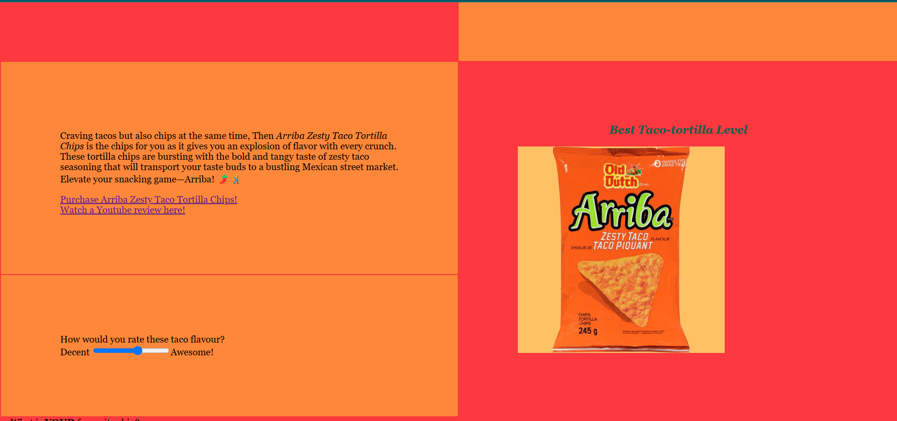
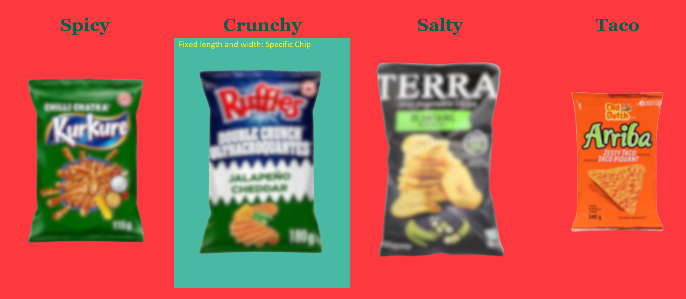
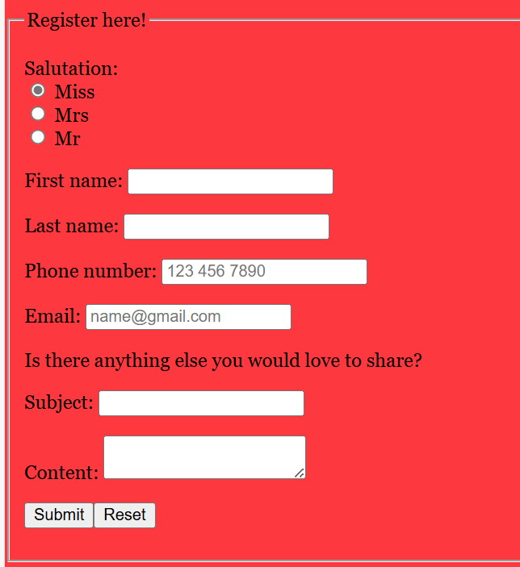

# ASsignment 2
# Document the category of issues that you identified through the manual and automated analysis above

Manual
	We identified images which had the same text for alternative text and title. There were images that did not have a comprehensive explanation on what the image contained.
	We also identified colours that were did not stand out due to lack of contrast,which made text difficult to read

Automated
	The website identified where there a lack of and possible heading. It detected redundant issues like links and a layout table as well

# What kinds of changes did you have to make (I do not want a list here). Generalize the types of issues that you created when building your website, and then the general type of changes that you made to resolve those issues.

To address the identified issues, We added new elements like header and improve on the description of attributes. We also swapped for better display option like higher contrast of colour for clear view by using the colour black to ensure that text is legible against its background.

	We kept the "redundant" links on page 1 as we wanted to implement a link that goes directly to a specific area on another page but were unable to do so.

# How do these accessibility changes connect with the Gestalt principles we discussed earlier this semester?
- Figure-Ground: Improved color contrast helps distinguish foreground content from the background.
- Similarity: Consistent use of design elements makes the interface more predictable and easier to navigate.
	The accessibility changes connect with Gestalt principles in the following ways:
	The colour and headings of the texts play a part in continunity and closure. As the colour continues, it is easy to see that the topic at hand is the same. When the colour changes and a larger sized heading element is seen, it can be perceived that a new subject is about to begin.

	Proximity of certain elements are also taken into account so that redundant elements, like links that point to the same website, would be removed. This prevents confusion as separate items should refer to separate places, especially when they are close together. Users may be confused as to why they point to the same place.
Closure:

Clearly defined and well-labeled elements allow users to perceive incomplete shapes or elements as complete, which can reduce confusion and improve the overall user experience.

Continuity:

A predictable and structured layout guides the user’s eye smoothly from one section to the next, making it easier for them to follow and understand the content flow.

Common Fate:

Interactive elements like buttons and links that are styled and behave consistently are perceived as part of the same group, reinforcing their functionality and making them easier to use.

Symmetry:

Balanced and symmetrical layouts create a sense of harmony and order, making the interface more aesthetically pleasing and easier to navigate.

# Assignment 1

# Instructions

https://docs.google.com/document/d/1FQ8_7J8ZwtUmNAGYCSjdGhZWqdfgW86C0wREJ9Q3grE/edit?usp=sharing

# Part 1
> Complete & submit this part **at least** one week before the assignment deadline.

### Assignment Tasks & the person responsible

Shweta
1. Drawings (Generated by AI)
	All Pages
	Dream Chips: Create visual representations of Dream Chip, showcasing design and branding.
	Logo: Design a distinctive logo that encapsulates our brand identity and appeals to our target audience.

2. Images/GIFs
	Page 1
	MRU Logo: Incorporate the logo of MRU to establish credibility and partnership.
	Our Chips (Blurred): Use blurred images of our chips to create a visually intriguing effect.
	Page 2
	Picked Chips: Feature 4 images showcasing our selected chip varieties.
	Star Ratings: Display star images that illustrate customer ratings and feedback.
	All pages
	Contact Information: Provide visuals that support our contact details for easy accessibility.

3. Gathering User Information
	Ratings: Implement star choice for users to provide ratings for our products.
	Feedback: Create a form for users to submit feedback about their experience.
	User Information Collection: Gather essential user details, including email, phone number, name, and age.

4. Links
	External Links
	Picked Chips: Add links to external resources or reviews for our picked chips.
	Star Ratings: Include links to platforms where our star ratings can be found.

Mary
1. Descriptions
	Page 1
	Purpose: Articulate the mission and vision of our website, explaining what we aim to achieve.
	Dream: Describe our aspirations and what motivates us to eat chips.
	Page 3
	Event: Promotions related to our chips.

ALL PAGES
2. Social Media
	Instagram (3 Posts): Plan and create 3 engaging Instagram posts that highlight our selected chips.
	Contact Information: Include email and phone number for customer inquiries and support.

ALL PAGES
3. Links
	Internal Links:
	Navigation: Ensure that navigation links are available on all pages for seamless browsing.
	Contact Page: Include a link to the contact page for easy access.
	Within Page Links: Create internal links that connect relevant sections within the same page.

Together
1. CSS
	Need to decide on color and font scheme (colour blindness)

2. Descriptions
	Page 1
	Personal Information: A personal bio that reflects our background and interests.
	Page 2
	Picked Chips (2 each): Provide detailed descriptions of the selected chip varieties, including their unique characteristics.
	Page 3
	Dream Chips: Outline our concept for "Dream Chips," detailing the name, flavor options, and design aesthetics.

3. Images/GIFs
	Page 1
	Personal Image: Include a personal image that represents us.

### Sketches for the website and short description

 
This image represents a sketch of what the first page our website would look like.

This image represents a sketch of what the second page our website would look like.

This image represents a sketch of what the third page our website would look like.

# Part 2
> This is where you should describe how the Gestalt principles apply to your site

1. Proximity

	In page1.html, our website's navigation menu items are placed close together, implying that they are related and belong to the same group and this group is basically information or more information. You would notice that the same principle is applied to both CEO's information in the "About Us" section.
	 
	 

2. Similarity

	In page2.html, we decided to make use of consistent styling for the chip descriptions, including the same font, color, and layout. Each chip's section has a similar structure, with an image on one side and a description on the other. This similarity in design will help users to quickly identify and compare the different chips.
	 

3. Continuity

	In page3, we tried to incoproate the layout of the page so that it maintains a logical flow from the event announcement to the details, followed by the registration form, then what we envision for our dream chips and finally the Instagram posts. This continuity will help users to navigate the contents we have smoothly. Also, we uses headings and subheadings; which contributes to this flow.
	 

4. Closure

	In page3.html, we applied the use of checkboxes with images which allow users to express their intentions about attending the event. The images of "yes" and "no" help users quickly understand their options and completing the interaction.
	 

5. Symmetry

	In page2.html, we employed alternating sides for the chips and their descriptions while maintaining a consistent table arrangement in terms of colors, size, font, and style. The symmetrical layout of the table fosters a sense of balance, making it easier to identify and categorize the items. Additionally, the uniform color of similar items gives users a perception of stability and orderliness.
	 

6. Figure/Ground

	

	In page1.html, we distinguished the chips from the overall background (the table and plain red backdrop) by changing the chip background color when users hover their mouse over it. This helps users concentrate on the content of the smaller, brightly colored background of the blurred chips. The chips are also of a fixed size and do not overlap with others, ensuring that users can easily identify the specific chip being referenced.
	
7. Common Fate

	

	In page3.html, the items in the registration section are arranged vertically with a consistent design: a label on the left followed by an input box for users to enter their information. This uniform design and placement encourage users to perceive all the input fields as interconnected, forming a cohesive group. Recognizing the registration section as a single unit will facilitate easier navigation through the website and reduce confusion.

### Gestalt principles write-up (point form)
> Include images here to make your points easier to understand (and you will have to write less too!)

